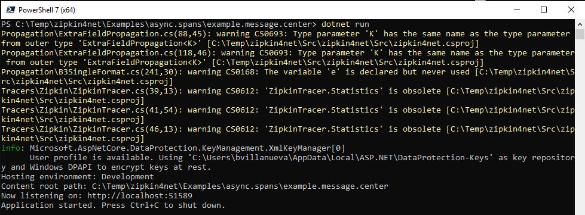
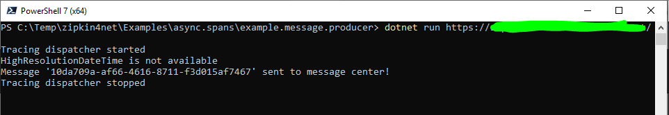
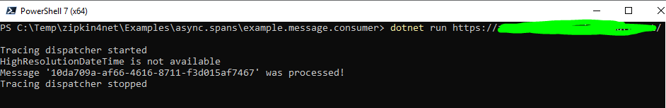
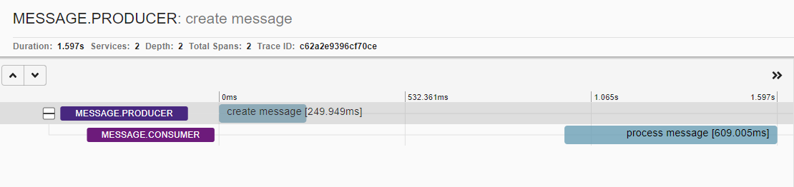

# Basic example showing how to record async spans between PRODUCER and CONSUMER applications

This document will show how to implement basic PRODUCER and CONSUMER spans using zipkin4net library.

## Implementation Overview

We have 3 applications to produce example PRODUCER and CONSUMER spans.

- `example.message.center` - Stores and pops messages. The messages contain trace information.
- `example.message.producer` - Creates a message with trace information and stores it to `example.message.center`. Logs PRODUCER span to zipkin server.
- `example.message.consumer` - Fetches the message from `example.message.center`. Logs CONSUMER span to zipkin server.

## Pre-requisites

- To build the example, you need to install at least [dotnet 2.2](https://dotnet.microsoft.com/download/dotnet-core/2.2)
- To run the examples, you need a live zipkin server.

## Running the example

1. Run `example.message.center` app
    - On a command line, navigate to `Examples\async.spans\example.message.center`
    - Run `dotnet run`
    

2. Run `example.message.producer` app
    - On a command line, navigate to `Examples\async.spans\example.message.producer`
    - Run `dotnet run <base url of live zipkin server>`
    

3. Run `example.message.consumer` app
    - On a command line, navigate to `Examples\async.spans\example.message.consumer`
    - Run `dotnet run <base url of live zipkin server>`
    

4. Check the output
    - Go to zipkin UI
    - Search for `message.producer` or `message.consumer` as serviceName
    - Click one of the search result, it should show the PRODUCER and CONSUMER spans
    

## What to take note on how to create/use PRODUCER and CONSUMER spans

### PRODUCER spans

- To make a PRODUCER span, you need to use `ProducerTrace` class 
- Example code from [example.message.producer](example.message.producer/Program.cs)
  ```csharp
  using (var messageProducerTrace = new ProducerTrace("<Application name>", "<RPC here>"))
  {
      // TracedActionAsync extension method logs error annotation if exception occurs
      await messageProducerTrace.TracedActionAsync(ProduceMessage(messageProducerTrace.Trace.CurrentSpan, text));
      messageProducerTrace.AddAnnotation(Annotations.Tag("sampleProducerTag", "success!"));
  }
  ```
- `TracedActionAsync` is used to run the process that is measured to log error annotation in your zipkin trace if exception is thrown.
- Make a way that trace information is passed to the consumer. So in the example, the trace information is part of the message which will be parsed by the consumer application to create CONSUMER spans.
- Also, custom annotations can be added using the ProducerTrace object method `AddAnnotation`.

### CONSUMER spans

- To make a CONSUMER span, you need to use `ConsumerTrace` class 
- Example code from [example.message.consumer](example.message.consumer/Program.cs)
  ```csharp
  static async Task ProcessMessage(Message message)
  {
      // need to supply trace information from producer
      using (var messageConsumerTrace = new ConsumerTrace(
          serviceName: "<Application name>",
          rpc:  "<RPC here>",
          encodedTraceId: message.TraceId,
          encodedSpanId: message.SpanId,
          encodedParentSpanId: message.ParentId,
          sampledStr: message.Sampled,
          flagsStr: message.Flags.ToString(CultureInfo.InvariantCulture)))
      {
          await messageConsumerTrace.TracedActionAsync(Task.Delay(600)); // Test delay for mock processing
          messageConsumerTrace.AddAnnotation(Annotations.Tag("sampleConsumerTag", "success!"));
      }
  }
  ```
- In the example PRODUCER application passed the trace information through the `message` object. Using the trace information, CONSUMER span is created.
- `TracedActionAsync` is used to run the process that is measured to log error annotation in your zipkin trace if exception is thrown.
- Also, custom annotations can be added using the ConsumerTrace object method `AddAnnotation`.
